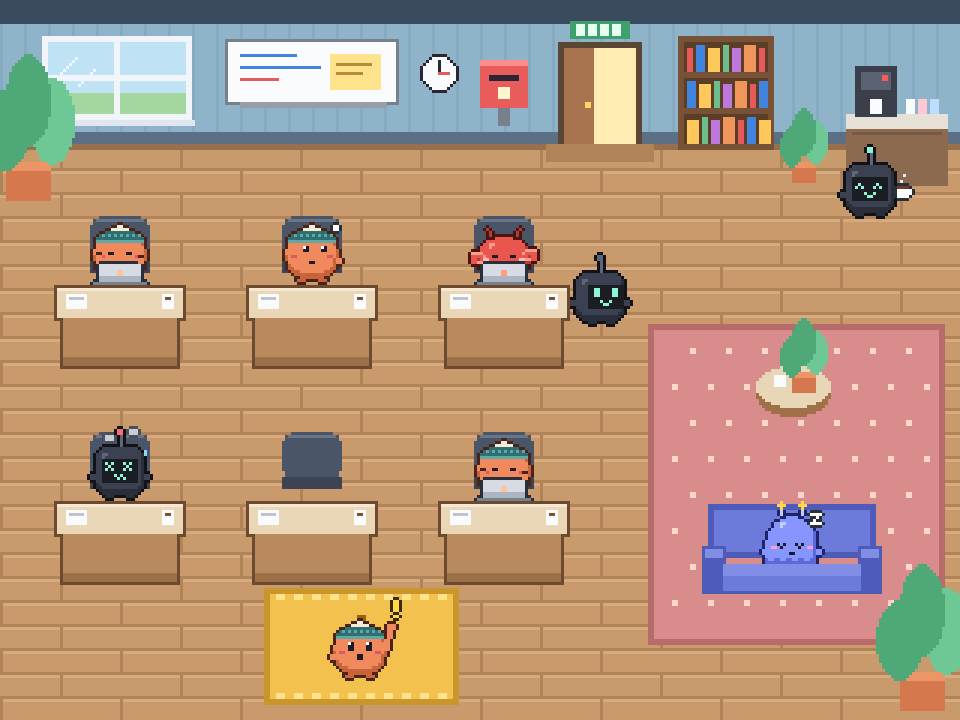
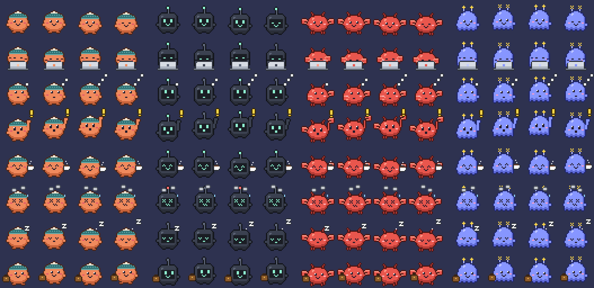
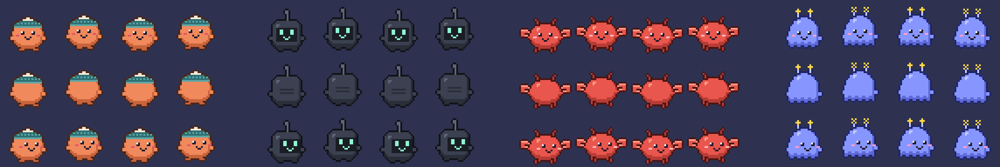

# 02. 디자인 컨셉

> 디자인 캔버스(인터랙티브, 비공개): https://claude.ai/artifact/9Weyisymw4DY1VrrHGkCZ5
> 원본: [`design/`](../design) · 캐릭터·맵 에셋: [`sprites/`](../sprites)
> 캔버스의 각 화면은 재생 버튼을 누르면 펫 클릭, 허용/거절, 이름 바꾸기가 동작합니다.

## 시안 한눈에

| 시안 | 아트보드 | 데스크탑 | 사무실 | 장점 / 단점 |
|---|---|---|---|---|
| **E · 탑뷰 오피스** ★최신 | `E-Office` | (사무실 중심) | 위에서 내려다보는 좁은 픽셀 사무실. 캐릭터가 크고(타일 2칸) 실제로 걸어 다님 | 살아 움직이고 상태가 제일 잘 보임 / 데스크탑 미니 모드는 아직 없음 |
| **A · 모찌 플로트** | `Main`, `A-Office` | 비눗방울 속 말랑 펫이 화면 위를 둥둥 | 노을 지는 파스텔 작업실 + 근무표 | 가장 귀엽고 부드러움 / 떠다니는 펫이 작업을 가릴 수 있음 |
| **B · 도트 오피스** | `B-Desktop`, `B-Office` | 픽셀 직원들이 창 위쪽 테두리·작업표시줄 위를 걸어 다님 | 2층 건물 단면 야근 모드 + 출근부 + RPG 대화창 | 게임 느낌, 실제 스프라이트로 동작 / 픽셀 폰트라 한글이 아쉬움 |
| **C · 야근 빌딩** | `C-Desktop`, `C-Office` | 화면 오른쪽 끝에서 빼꼼, 급한 순서로 줄 섬 | 리소 인쇄풍 빌딩 단면. 층 = 에이전트 팀, 방 = 세션 | 정보 보기 제일 좋음 / 귀여움은 가장 덜함 |
| **D · 스킨 규격** | `Spec` | — | — | 시트·pet.json 규격, 상태 우선순위, 이름표 규칙 |

## E · 탑뷰 오피스 (게더타운 스타일)

- **공간:** 방 하나, 타일 20×15칸(48px 타일). 캐릭터는 타일 2칸 높이(96px)로 크게.
- **움직임 (스크립트, 100ms 틱)**
  - 퇴근: 자리에서 일어나 문으로 걸어 나가고 사라짐 → 잠시 뒤 새 세션이 문으로 **출근**해 빈자리에 앉음
  - 다 했어요: 커피 머신 → 라운지 산책
  - 비서(OpenClaw): 가끔 우편함 보러 갔다 옴
  - 꾸벅꾸벅: 소파에서 졸기
- **호출 존:** 아래 노란 매트. 권한이 필요하면 거기까지 **걸어와서** 손을 흔들고, 큰 분홍 말풍선에서 바로 허용/거절. 허용하면 자리로 돌아가 일하다가 다음 질문을 들고 다시 옴.
- **잘 보이는 상태**
  - 말풍선: 굵은 테두리 + 상태 색 아이콘 + 굵은 14px. 막혔어요는 주황, 다 했어요는 파랑 바탕
  - 이름표: 발밑(앉아 있으면 책상 앞판) + 상태 색 점
  - 오른쪽 패널: 상태별 큰 숫자 카드, 불러요 카드, 급한 순서 목록(누르면 펼쳐져 이름표 달기)
- **겹침:** 책상·소파 앞판은 따로 떼어 y 정렬. 책상 뒤를 지나가면 가려지고 앞을 지나가면 위에 보임.

## 공통 규칙

### 상태 8개 (겹치면 왼쪽이 이김)

`불러요 > 막혔어요 > 일하는 중 > 생각 중 > 다 했어요 > 대기 > 꾸벅꾸벅 > 퇴근`

| 상태 | 언제 | 이벤트(가정) |
|---|---|---|
| 불러요 call | 권한 요청·질문으로 나를 기다릴 때 | Notification · permission |
| 막혔어요 error | 같은 실패가 2번 이상 | PostToolUse 실패 |
| 일하는 중 work | 툴 실행 중 | PreToolUse → PostToolUse |
| 생각 중 think | 툴 없이 응답 생성 중 | stream, no tool |
| 다 했어요 done | 턴 종료 후 10분 | Stop |
| 대기 idle | 열려 있지만 조용 (15분 미만) | — |
| 꾸벅꾸벅 sleep | 15분 무활동 | idle ≥ 15m |
| 퇴근 leave | 1시간 무활동 또는 세션 종료 | idle ≥ 60m · SessionEnd |

### 이름표

1. 내가 붙인 별명 (코코, 셜록)
2. 세션 제목 — 에이전트가 붙인 제목 (9월 회고 글 발행)
3. 레포 · 브랜치 — 둘 다 없을 때, 같은 레포면 `#2`

별명은 세션 ID에 붙어 유지되고, 비우면 세션 제목으로 돌아감. 에이전트 종류별 추천 이름(코코·당근·모모 / 네모·삑삑·큐브 / 집게·꽃게·가재 / 별이·반짝·쌍둥).

### 캐릭터 (에이전트 종류별)

| 에이전트 | 캐릭터 | 특징 |
|---|---|---|
| Claude Code | 주황 콩 | 청록 비니 |
| Codex | 네모 로봇 | 민트 LED 눈, 안테나 |
| OpenClaw | 집게 친구 | 양손 집게, 더듬이 |
| Gemini CLI | 별 유령 | 별 두 개 더듬이, 떠다님 |

### 스킨 규격 (갈아 끼우기)

- 상태 시트: 프레임 32×32, 4프레임 × 8행 = 128×256 PNG. 행 순서 `idle, work, think, call, done, error, sleep, leave`
- 걷기 시트(시안 E용): 4프레임 × 3행(아래 · 위(뒷모습) · 옆, 왼쪽은 좌우 반전) = 128×96 PNG
- 발끝 기준점 (16, 30), 말풍선 기준점 (16, 2)
- `sprites/pets.json`: `match.agent`로 에이전트 종류에 연결, `names`는 추천 이름, `walk`는 걷기 시트

## 다음 단계 후보

1. 시안 E를 데스크탑으로: 평소엔 사무실을 작은 창(미니 모드)으로, 부르는 애만 화면 위로 튀어나오기
2. 시안 섞기: E 사무실 + A의 말풍선 바로 허용 + C의 급한 순서 줄서기
3. 실제 프로토타입: Tauri/Electron 투명 창 + Claude Code 훅 이벤트로 상태 연결
