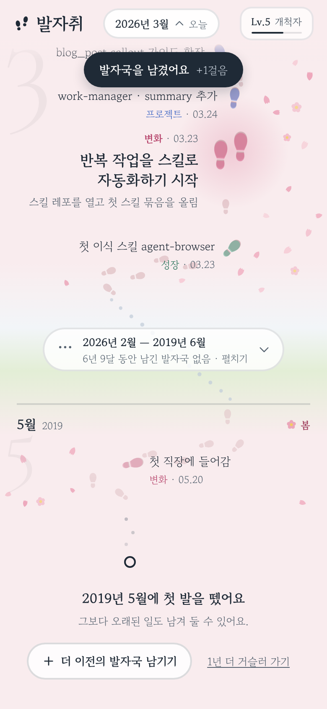

# 발자취

내가 걸어온 업적, 프로젝트, 성장, 변화를 계절이 흐르는 길 위에 발자국으로 남기는 앱.

- 맨 위가 **오늘**입니다. "지금 여기"의 **+** 를 누르면 바로 오늘의 발자국을 남깁니다.
- 땅이 달마다 계절을 입습니다 — 봄 꽃잎, 여름 풀, 가을 낙엽, 겨울 눈.
- 길 위 **아무 날이나 누르면** 그날에 남기고, 발자국을 누르면 고치거나 지웁니다.
- 남기는 동안 **길 위에 발자국이 실시간으로** 찍혀 보이고, 아래에서 시트가 올라옵니다(날짜 달력, 크기, 카테고리, 제목, 메모).
- 빈 달은 **짧게 접히고**, 발자국이 생기면 그만큼 늘어납니다. 3달 이상 비면 **⋯ 구간**으로 건너뛰고, 눌러서 펼칩니다.
- 몇 년 전 일도 남길 수 있습니다. 길 끝 "더 이전의 발자국 남기기" → 달력에서 해/달을 고르면 그 사이가 접힌 채 길이 이어집니다.
- **큰 발자국**(+5걸음)은 성취와 전환점, **작은 발자국**(+1걸음)은 자잘한 진척. 걸음이 쌓이면 레벨이 오릅니다.

| 길 | 남기는 중 | 찍은 순간 | 몇 년을 건너뛴 길 | 처음 |
|---|---|---|---|---|
|  |  |  |  |  |

## 스택

**Expo (React Native) + TypeScript** — 코드 하나로 웹 · Android · iOS.

| 영역 | 선택 | 이유 |
|---|---|---|
| 앱 프레임워크 | Expo SDK 57, React Native 0.86 | 웹/안드로이드를 먼저, iOS는 같은 코드로. EAS로 맥 없이 빌드·배포 |
| 라우팅 | Expo Router | 파일 기반. 목록·통계 탭을 붙일 때 `src/app` 아래 파일만 추가하면 됨 |
| 그림 | react-native-svg | 발자국·계절 장식을 벡터로, 웹과 네이티브에서 동일하게 |
| 상태·저장 | zustand + AsyncStorage | 로컬 우선. 웹에서는 localStorage. 동기화 백엔드는 나중에 스토어에 연결 |
| 글꼴 | Gowun Batang, Cormorant Garamond | 시안 D(눈길)의 조용한 세리프 톤 |

## 실행

```bash
npm install
npm run web        # 브라우저
npm run android    # 안드로이드 (에뮬레이터 또는 Expo Go)
npm run ios        # iOS (macOS 또는 Expo Go)
```

검사:

```bash
npm run typecheck
npm run lint
npm test
npm run build:web     # dist/ 정적 웹 빌드
npm run build:single  # 한 장짜리 HTML (artifact 등 단일 페이지 호스팅용)
```

## 구조

```
src/
├── app/
│   ├── _layout.tsx        # 글꼴, 스택
│   └── index.tsx          # 길 — 타임라인, 시트, 토스트를 묶는 화면
├── components/
│   ├── MonthSection.tsx   # 한 달의 땅·걸음·발자국·라벨, "지금 여기" + 버튼
│   ├── GapSection.tsx     # 접힌 빈 구간 (⋯)
│   ├── StartSection.tsx   # 길의 출발점, 더 이전 기록
│   ├── TrailHead.tsx      # 다가오는 계절
│   ├── TopBar.tsx         # 워드마크, 레벨, 지금 보는 달
│   ├── FootprintSheet.tsx # 남기기/고치기 바텀시트
│   ├── Calendar.tsx       # 달력 (해·달 빠른 이동)
│   └── Toast.tsx, glyphs.tsx, icons.tsx, ground.ts, theme.ts
├── domain/                # 날짜, 카테고리, 레벨, 계절, 한국어 조사
├── store/                 # zustand 스토어 (로컬 저장), 예시 데이터
└── trail/
    ├── layout.ts          # 한 달의 레이아웃 엔진 (순수 함수)
    └── timeline.ts        # 보일 달 / 접을 구간 결정
design/mockups/            # 디자인 시안 원본 (A~G)
```

### 길 레이아웃 엔진 (`src/trail/layout.ts`)

- 길의 가로 위치는 **연속된 시간**(1970-01-01부터의 일수)만의 함수라서, 달과 달이 이음매 없이 이어집니다.
- 한 달 안에서는 화면 y ↔ 시간 u 사이의 구간별 선형 매핑을 만들어, 발자국이 몰리면 서로 밀어내면서도 **정확히 그 날짜의 길 위**에 놓입니다.
- 달의 높이는 내용이 정합니다. 빈 달은 발자국 하나 남길 만큼만, 발자국이 생기면 라벨이 겹치지 않을 만큼 늘어납니다.
- 같은 쪽 라벨이 겹치지 않도록 밀어내고, 걸음과 장식은 발자국·글자·길을 피해 배치됩니다.
- `timeline.ts`는 3달 이상 빈 구간을 하나로 접습니다. 펼친 구간은 앱을 다시 열 때까지 펼쳐 둡니다.
- 탭한 위치는 같은 매핑의 역으로 날짜가 됩니다.

## 다음 단계

- [ ] 목록 탭 (카테고리·크기 필터, 검색)
- [ ] 통계 탭 (월별·카테고리별, 레벨 기록)
- [ ] 계정과 동기화 (Supabase 등) — 스토어에 동기화 계층만 추가
- [ ] 앱 아이콘·스플래시 (지금은 Expo 기본값)
- [ ] EAS Build로 안드로이드 APK/AAB, iOS 빌드
