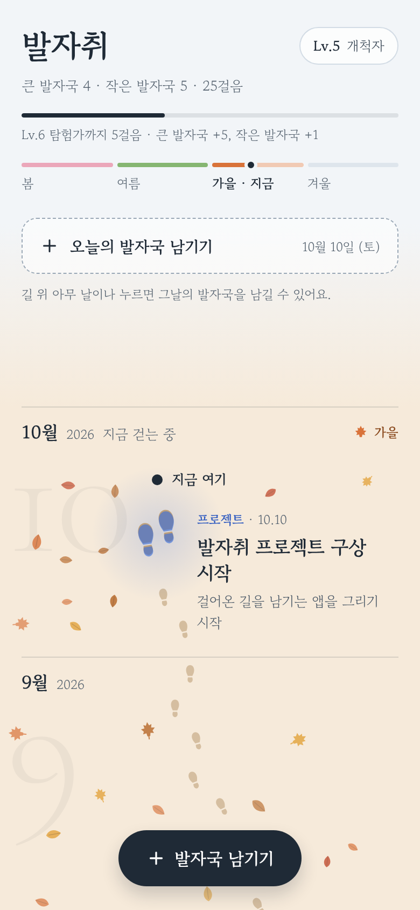
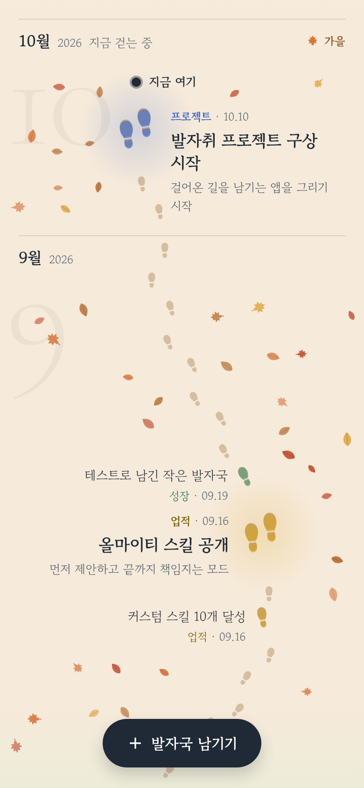
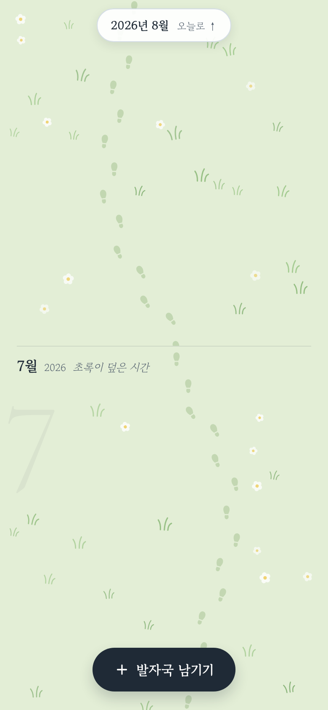
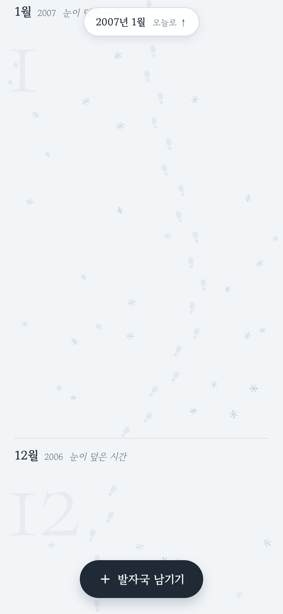
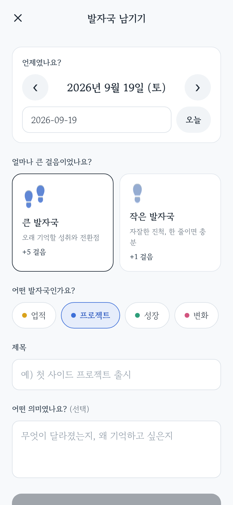

# 발자취

내가 걸어온 업적, 프로젝트, 성장, 변화를 계절이 흐르는 길 위에 발자국으로 남기는 앱.

- 맨 위가 **오늘**, 아래로 내릴수록 지난달·지난해로 끝없이 이어집니다.
- 땅이 달마다 계절을 입습니다 — 봄 꽃잎, 여름 풀, 가을 낙엽, 겨울 눈.
- 길 위 **아무 날이나 누르면** 그날의 발자국을 남길 수 있고, 발자국을 누르면 고치거나 지울 수 있습니다.
- **큰 발자국**(+5걸음)은 오래 기억할 성취와 전환점, **작은 발자국**(+1걸음)은 자잘한 진척.
- 카테고리: 업적 · 프로젝트 · 성장 · 변화. 걸음이 쌓이면 레벨이 오릅니다.

| 오늘 | 가을 길 | 여름 | 지난해 | 남기기 |
|---|---|---|---|---|
|  |  |  |  |  |

## 스택

**Expo (React Native) + TypeScript** — 코드 하나로 웹 · Android · iOS.

| 영역 | 선택 | 이유 |
|---|---|---|
| 앱 프레임워크 | Expo SDK 57, React Native 0.86 | 웹/안드로이드를 먼저, iOS는 같은 코드로. EAS로 맥 없이 빌드·배포 |
| 라우팅 | Expo Router | 파일 기반. 목록·통계 탭을 붙일 때 `src/app` 아래 파일만 추가하면 됨 |
| 그림 | react-native-svg | 발자국·계절 장식을 벡터로, 웹과 네이티브에서 동일하게 |
| 상태·저장 | zustand + AsyncStorage | 로컬 우선. 웹에서는 localStorage. 동기화 백엔드는 나중에 스토어에 연결 |
| 글꼴 | Gowun Batang, Cormorant Garamond | 시안 D(눈길)의 조용한 세리프 톤 |

## 실행

```bash
npm install
npm run web        # 브라우저
npm run android    # 안드로이드 (에뮬레이터 또는 Expo Go)
npm run ios        # iOS (macOS 또는 Expo Go)
```

검사:

```bash
npm run typecheck
npm run lint
npm test
npm run build:web  # dist/ 정적 웹 빌드
```

## 구조

```
src/
├── app/                 # 화면 (Expo Router)
│   ├── _layout.tsx      # 글꼴, 스택
│   ├── index.tsx        # 길 — 무한 스크롤 타임라인
│   └── editor.tsx       # 발자국 남기기/고치기 (모달)
├── components/          # MonthSection, TrailHead, 발자국·장식 글리프
├── domain/              # 날짜, 카테고리, 레벨, 계절 — 순수 로직
├── store/               # zustand 스토어 (로컬 저장), 예시 데이터
└── trail/               # 길 레이아웃 엔진 (순수 함수, 단위 테스트)
design/mockups/          # 디자인 시안 원본 (A~G)
```

### 길 레이아웃 엔진 (`src/trail/layout.ts`)

- 길의 가로 위치는 **연속된 시간**(1970-01-01부터의 일수)만의 함수라서, 달과 달이 이음매 없이 이어집니다.
- 한 달 안에서는 화면 y ↔ 시간 u 사이의 구간별 선형 매핑을 만들어, 발자국이 몰리면 서로 밀어내면서도 **정확히 그 날짜의 길 위**에 놓입니다.
- 같은 쪽 라벨이 겹치지 않도록 밀어내고, 걸음과 장식은 발자국·글자·길을 피해 배치됩니다.
- 탭한 위치는 같은 매핑의 역으로 날짜가 됩니다.

## 다음 단계

- [ ] 목록 탭 (카테고리·크기 필터, 검색)
- [ ] 통계 탭 (월별·카테고리별, 레벨 기록)
- [ ] 연도 바로가기
- [ ] 계정과 동기화 (Supabase 등) — 스토어에 동기화 계층만 추가
- [ ] 앱 아이콘·스플래시 (지금은 Expo 기본값)
- [ ] EAS Build로 안드로이드 APK/AAB, iOS 빌드
